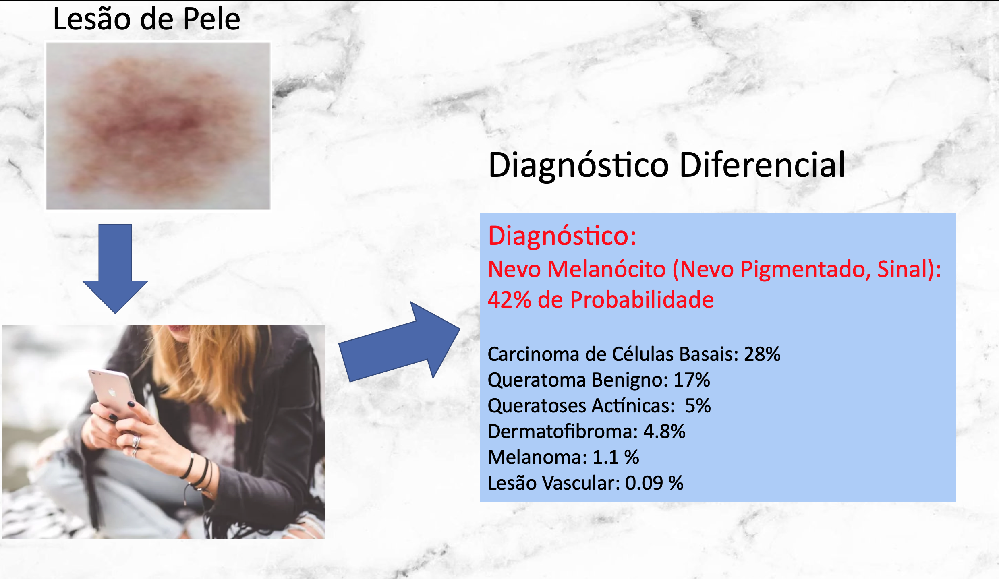

# Detecção de doenças de pele utilizando CNN (Redes Neurais Convolucionais) - V0.01   Novembro, 2019   

Dataset = 12.000 imagens  
Imagens - 6 GB Imagens  
Uso de GPU para treinar o modelo    

Há, literalmente, milhares de doenças cutâneas específicas. Abordaremos nesta pesquisa, onze classes de doenças de pele que abrangem mais de 95% de todos os distúrbios de pigmentação diagnosticados diariamente na prática clínica

Doenças de Pele: 
1. Acne *
2. Melanoma
3. Psoríase *
4. Dermatites (de contato, atípica) *
5. Queratose Actínica (devido à radiação solar)
6. CBC - Carcinoma Baso-Celular
7. Nevo Melanócito (Nevo Pigmentado, Sinal)
8. Dermatofibroma (Histiocitoma Fibroso Benigno)
9. Queratose Actínica
10. Lesões de pele Vasculares
11. Queratoses Seborréicas

(*) Distúrbios de pele mais comuns no Brasil, segundo Dermatologistas e Epidemiologistas.

